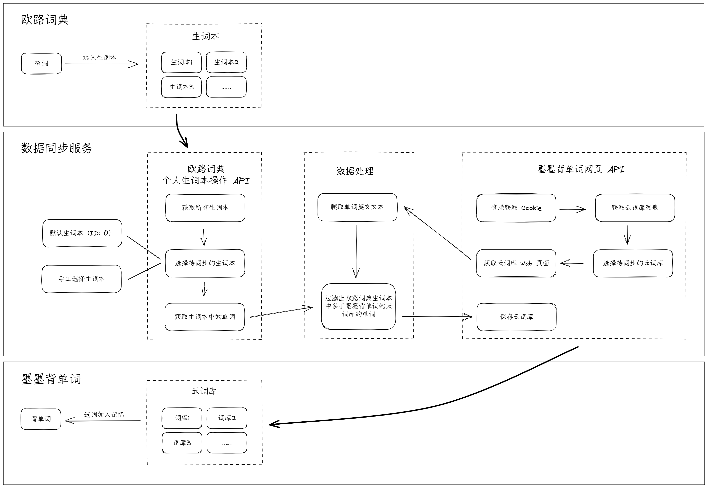

# EudicSyncToMaiMemo

[欧路词典](https://www.eudic.net/v4/en/app/eudic) 生词本同步到 [墨墨背单词](https://www.maimemo.com/) 云词库。

## 介绍

由于欧路词典提供了全平台的客户端，并且支持可定制的词库，我在日常生活与工作中都使用欧路词典来收集生词。然后我会定期将新的生词导入到更专注于背单词的软件——墨墨背单词中进行记忆。为了减少重复的工作，我开发了这个项目。

### 流程图



## 使用说明

### 获取授权信息

欧路词典需要先获取相应的授权信息。按照以下步骤操作：

1. 访问 [欧路词典开放平台授权页面](https://my.eudic.net/OpenAPI/Authorization)。
2. 完成登录后在页面找到授权信息。

墨墨背单词需要配置账号和密码，在后续同步服务中会自动完成登录授权。

### 获取词库 ID

#### 获取欧路词典生词本 ID

欧路词典默认的生词本 ID 是 `0`。若希望使用特定的生词本，需按照以下步骤操作：

1. 使用 API 测试工具向 <https://api.frdic.com/api/open/v1/studylist/category?language=en> 发起请求。
2. 查看响应数据中的生词本列表，获取所需生词本的 ID。

#### 获取墨墨背单词云词库 ID

通过以下步骤来找到的云词库 ID：

1. 登录 [墨墨背单词网页版](https://www.maimemo.com/)。
2. 导航至「我的编辑」-「云词库」。
3. 新建云词库或选择一个已有的云词库。
4. 在云词库页面的网址中查找词库 ID（例如 `https://www.maimemo.com/notepad/detail/1234567?scene=`, 这里的 `1234567` 就是的云词库 ID）。

### 运行同步程序

可以通过两种方式运行同步程序：作为控制台程序或作为 Windows 服务。

#### 控制台程序

1. 访问 [Releases 页面](https://github.com/viazure/EudicSyncToMaiMemo/releases) 并下载名为 `EudicSyncToMaiMemo-版本号-win-x64.zip` 的压缩包。
2. 解压缩下载的文件。
3. [修改配置文件](#修改配置文件)以设置相应的词库信息。
4. 双击 `EudicSyncToMaiMemo.exe` 来运行程序。每次运行都会同步一次。

#### Windows 服务

1. 访问 [Releases 页面](https://github.com/viazure/EudicSyncToMaiMemo/releases) 并下载名为 `EudicSyncToMaiMemo-版本号-win-x64.msi` 的安装文件。
2. 安装下载的 `.msi` 文件。
3. 打开目录 `C:\Program Files\Eudic Sync To MaiMemo Service` ，[修改配置文件](#修改配置文件)以设置相应的词库信息。
4. 打开 Windows 的「服务」管理器。
5. 找到并启动「Eudic Sync To MaiMemo Service」。

当设置为 Windows 服务时，程序将自动每 7 天同步一次。

### 修改配置文件

**配置文件 `appsettings.json`**

```json
{
  "Eudic": {
    "Authorization": "NIS XXX",
    "DefaultBookId": "0"
  },
  "MaiMemo": {
    "Username": "your_username",
    "Password": "your_password",
    "DefaultNotepadId": "0"
  }
}
```

**字段说明：**

| 来源       | 字段名           | 说明                                     | 必填 |
| ---------- | ---------------- | ---------------------------------------- | ---- |
| 欧路词典   | Authorization    | 接口授权，有了这个授权才能请求后续的接口 | True |
| 欧路词典   | DefaultBookId    | 默认同步的生词本 Id，默认生词本 id 为 0  | True |
| 墨墨背单词 | Username         | 用于登录的用户名（邮箱或手机号）         | True |
| 墨墨背单词 | Password         | 用于登录的密码                           | True |
| 墨墨背单词 | DefaultNotepadId | 默认同步的云词库 id                      | True |

日志文件默认存储在路径 `C:\Program Files\Eudic Sync To MaiMemo Service\logs` 中，若需要更改日志文件的存放位置，可以修改配置文件中的 Serilog 节点，具体操作是调整 WriteTo 部分中 Args 下的 path 参数。

## 项目依赖

- [.NET 8 SDK](https://dotnet.microsoft.com/zh-cn/download/dotnet/8.0)
- Visual Studio 2022 版本 17.8 或更高版本

## Todo

- [x] MVP 版本：默认词库自动同步（控制台程序）
- [x] 可注册为 Windows 服务，并定期执行
- [ ] 接入消息通知服务
- [ ] 接入 Telegram Bot，用于手动选择词库同步
