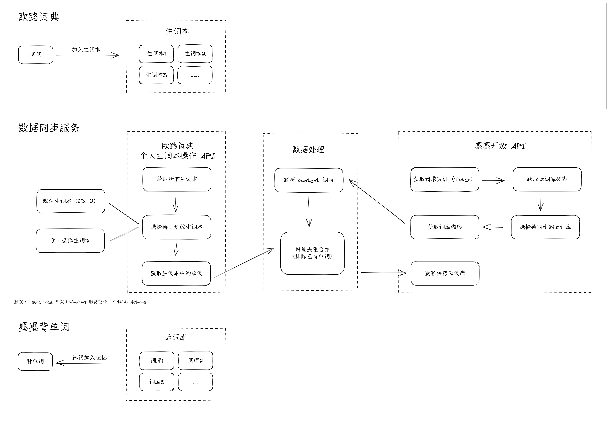

# EudicSyncToMaiMemo

[欧路词典](https://www.eudic.net/v4/en/app/eudic) 生词本同步到 [墨墨背单词](https://www.maimemo.com/) 云词库。

## 介绍

由于欧路词典提供了全平台的客户端，并且支持可定制的词库，我在日常生活与工作中都使用欧路词典来收集生词。然后我会定期将新的生词导入到更专注于背单词的软件——墨墨背单词中进行记忆。为了减少重复的工作，我开发了这个项目。

### 工作流程



## 使用说明

### 获取授权信息

#### 欧路词典

1. 访问 [欧路词典开放平台授权页面](https://my.eudic.net/OpenAPI/Authorization)
2. 完成登录后在页面找到 Authorization 值

#### 墨墨背单词（推荐：开放 API）

1. 获取请求凭证，有两种方式获取：
   1. 通过墨墨背单词 App：我的 -> 更多设置 -> 实验功能 -> 开放 API
   2. 点击[此处](https://open.maimemo.com/open/api/v1/tokens/openapi)获取
2. 复制 Token，配置到 `MaiMemo:Token`
3. 文档详情见 [墨墨开放 API](https://open.maimemo.com/)

#### 墨墨背单词（Legacy 过渡）

若尚未迁移 Token，可将 `MaiMemo:Provider` 设为 `Legacy`，继续使用用户名与密码，程序会通过网页登录完成授权。

### 获取词库 ID

#### 获取欧路词典生词本 ID

欧路词典默认的生词本 ID 是 `0`。若希望使用特定的生词本，需按照以下步骤操作：

1. 使用 API 测试工具向 [https://api.frdic.com/api/open/v1/studylist/category?language=en](https://api.frdic.com/api/open/v1/studylist/category?language=en) 发起请求
2. 查看响应数据中的生词本列表，获取所需生词本的 ID

#### 获取墨墨背单词云词库 ID

Open API 与网页版使用**不同的 ID**，请按 `MaiMemo:Provider` 选择：

**Open API 模式（推荐）：**

1. 用 Token 请求 [GET /open/api/v1/notepads](https://open.maimemo.com/)
2. 在响应中找到目标词库的 `id` 字段，格式为 `np-` 开头的长字符串
3. 填入 `MaiMemo:DefaultNotepadId`

若你只有网页版数字 ID、但记得词库标题，可改填 `MaiMemo:DefaultNotepadTitle`，程序会拉取列表按标题精确匹配（`DefaultNotepadId` 可暂填任意占位，如 `0`）

**Legacy 网页模式：**

1. 登录 [墨墨背单词网页版](https://www.maimemo.com/)
2. 导航至「我的编辑」-「云词库」
3. 打开目标云词库，从 URL 中取数字 ID（如 `https://www.maimemo.com/notepad/detail/1234567?scene=` 中的 `1234567`）
4. 填入 `MaiMemo:DefaultNotepadId`

### 运行同步程序

支持三种运行方式，共用同一套同步逻辑。

#### 控制台单次同步

1. 访问 [Releases 页面](https://github.com/viazure/EudicSyncToMaiMemo/releases) 下载对应平台产物（`win-x64.zip` / `linux-x64.tar.gz` / `osx-x64.tar.gz`）
2. 解压缩并 [修改配置文件](#修改配置文件)
3. 双击 `EudicSyncToMaiMemo.exe`，或执行：

```powershell
.\EudicSyncToMaiMemo.exe --sync-once
```

#### Windows 服务（自托管循环）

1. 下载 Release zip
2. [修改配置文件](#修改配置文件) 中的 `appsettings.json`
3. 将 `scripts/install-service.ps1` 拷贝至程序同级目录下，使用 PowerShell 以管理员身份运行
4. 服务会按 `Sync:IntervalDays` 定期同步

卸载服务：将 `scripts/uninstall-service.ps1` 拷贝至程序同级目录下，使用 PowerShell 以管理员身份运行

#### GitHub Actions 定时同步

在仓库 Settings → Secrets 中配置：

| Secret                | 说明               |
|-----------------------|--------------------|
| `EUDIC_AUTHORIZATION` | 欧路 Authorization |
| `EUDIC_BOOK_ID`       | 欧路生词本 ID      |
| `MAIMEMO_TOKEN`       | 墨墨开放 API Token |
| `MAIMEMO_NOTEPAD_ID`  | 墨墨云词库 ID      |
| `NOTIFICATION_*`      | 可选通知配置       |

workflow 见 [.github/workflows/sync.yml](.github/workflows/sync.yml)，支持 cron 与手动 `workflow_dispatch`。

本地模拟 GHA 环境变量：

```powershell
$env:Eudic__Authorization = "NIS xxx"
$env:Eudic__DefaultBookId = "0"
$env:MaiMemo__Provider = "OpenApi"
$env:MaiMemo__Token = "your_token"
$env:MaiMemo__DefaultNotepadId = "1234567"
dotnet run --project src/EudicSyncToMaiMemo/EudicSyncToMaiMemo.csproj -c Release -- --sync-once
```

### 修改配置文件

**配置文件 `appsettings.json`**

```json
{
  "Sync": {
    "IntervalDays": 7
  },
  "Eudic": {
    "Authorization": "NIS XXX",
    "DefaultBookId": "0"
  },
  "MaiMemo": {
    "Provider": "OpenApi",
    "Token": "your_token",
    "Username": "",
    "Password": "",
    "DefaultNotepadId": "np-your_notepad_id",
    "DefaultNotepadTitle": ""
  },
  "Notification": {
    "Enabled": false,
    "Url": "",
    "RequestBody": "",
    "Headers": ""
  }
}
```

**字段说明：**

| 来源     | 字段名                      | 说明                                        | 必填                   |
|----------|-----------------------------|---------------------------------------------|------------------------|
| 同步     | Sync:IntervalDays           | 自托管模式下两次同步间隔（天）              | Hosted 模式            |
| 欧路词典 | Eudic:Authorization         | 接口授权                                    | 是                     |
| 欧路词典 | Eudic:DefaultBookId         | 默认生词本 ID，0 为默认生词本               | 是                     |
| 墨墨     | MaiMemo:Provider            | `OpenApi` 或 `Legacy`                       | 是                     |
| 墨墨     | MaiMemo:Token               | 开放 API Token                              | Provider=OpenApi       |
| 墨墨     | MaiMemo:Username / Password | 网页登录                                    | Provider=Legacy        |
| 墨墨     | MaiMemo:DefaultNotepadId    | OpenApi：`np-` 开头 ID；Legacy：网页数字 ID | 是                     |
| 墨墨     | MaiMemo:DefaultNotepadTitle | OpenApi 下按标题匹配，与 np- ID 二选一      | OpenApi 且无 np- ID 时 |
| 通知     | Notification:*              | Webhook 通知                                | 否                     |

环境变量与配置键对应关系：`Eudic__Authorization`、`MaiMemo__Token` 等（双下划线）。

根节点 `SyncInterval` 仍兼容读取，建议迁移到 `Sync:IntervalDays`。

### 配置通知服务

消息通知服务的接入逻辑参考了 [jeessy2/ddns-go](https://github.com/jeessy2/ddns-go) 项目的通知服务实现，特此表示感谢。

#### 配置步骤

1. 打开配置文件 `appsettings.json`，找到 `Notification` 节点
2. 将 `Enabled` 设置为 `true`
3. 根据您使用的服务继续设置 `Url`、`RequestBody`、`Headers`
4. RequestBody 为转义后的 JSON 字符串，例如：`{\"message\":\"同步完成：{content} \"}`。为空时使用 GET，否则 POST

**支持的变量：**

| 变量名    | 说明                                         |
|-----------|----------------------------------------------|
| {content} | 同步结果：有新词时为单词列表，否则为状态说明 |

**示例（Server 酱）：**

```url
https://sctapi.ftqq.com/<SENDKEY>.send?title=单词同步&desp={content}
```

更多配置参考：[ddns-go Webhook 配置参考](https://github.com/jeessy2/ddns-go/issues/327)

## 构建与打包

开发者 clone 后可自行编译：

```powershell
# 编译与测试
dotnet build src/EudicSyncToMaiMemo.slnx -c Release
dotnet test src/EudicSyncToMaiMemo.slnx -c Release

# 发布 zip（输出到 artifacts/publish）
./scripts/publish.ps1
```

Release 由 tag `v*` 触发，产物包含 `win-x64.zip`、`linux-x64.tar.gz`、`osx-x64.tar.gz`。

## 项目依赖

- [.NET 10 SDK](https://dotnet.microsoft.com/download/dotnet/10.0)
- [Visual Studio 2022](https://visualstudio.microsoft.com/) 17.12 或更高版本（可选）

## 问题排查

日志默认位于 `%PROGRAMDATA%\EudicSyncToMaiMemo\logs`。GitHub Actions 与 `--sync-once` 模式同时输出到控制台。修改 Serilog `WriteTo` 可调整路径。

## Todo

- [x] MVP 版本：默认词库自动同步（控制台程序）
- [x] 可注册为 Windows 服务，并定期执行
- [x] 接入消息通知服务
- [x] 接入墨墨开放 API（Legacy 网页方案仍可选）
- [x] GitHub Actions 定时同步
- [x] 调整项目打包方式，支持多平台部署
- [ ] ~~接入 Telegram Bot~~，计划做可操作界面
